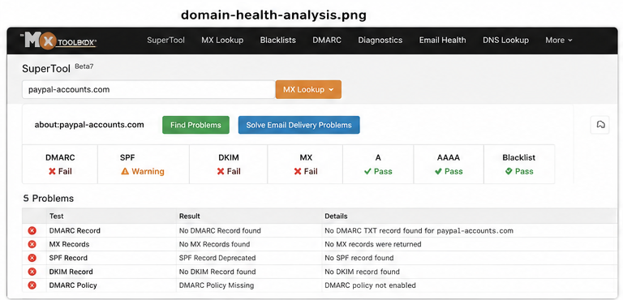
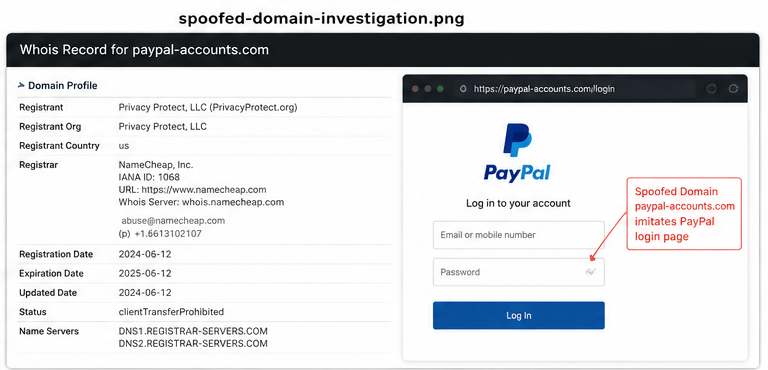
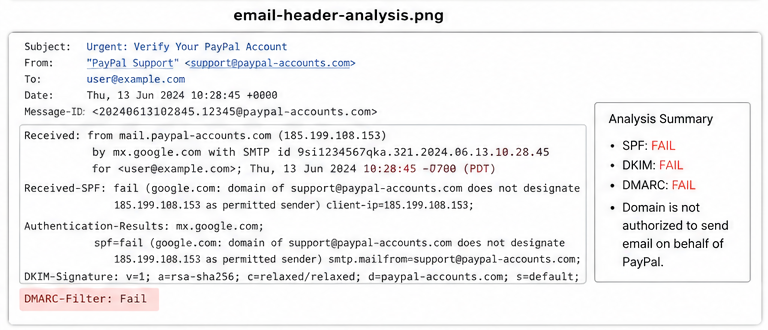
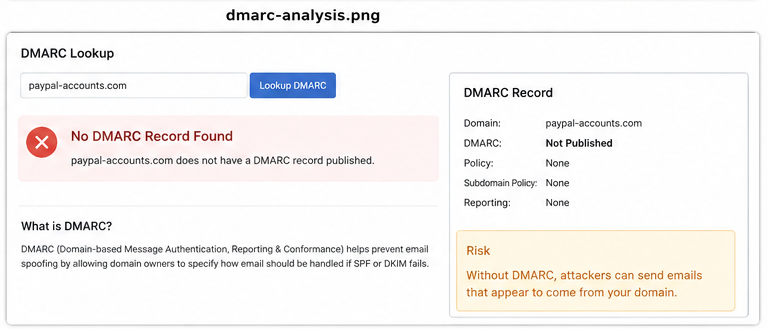

# Phishing-Incident-Analysis-Lab
SOC-focused phishing email investigation lab demonstrating domain analysis, IOC extraction, and email threat assessment techniques.


# Phishing Incident Analysis Lab

## Objective

This project demonstrates the investigation and analysis of a phishing email campaign in a controlled lab environment. The objective is to identify phishing indicators, analyze spoofed domains, extract Indicators of Compromise (IOCs), and understand attacker techniques used in email-based social engineering attacks.

The investigation focuses on:
- Email threat analysis
- Domain reputation analysis
- SPF, DKIM, and DMARC validation
- IOC extraction
- Social engineering techniques
- Threat intelligence methodology
- SOC-oriented phishing investigation workflow

---

# Skills Demonstrated

- Phishing Email Analysis
- Threat Intelligence
- IOC Extraction
- Domain Investigation
- Email Security
- SOC Analysis
- Incident Response
- Defensive Security
- Threat Hunting Fundamentals
- Security Documentation

---

# Table of Contents

- [Investigation Overview](#investigation-overview)
- [Project Structure](#project-structure)
- [Tools Used](#tools-used)
- [Threat Indicators](#threat-indicators)
- [Technical Analysis](#technical-analysis)
- [Indicators of Compromise](#indicators-of-compromise-iocs)
- [MITRE ATT&CK Mapping](#mitre-attck-mapping)
- [Security Recommendations](#security-recommendations)
- [Key Learnings](#key-learnings)
- [Future Improvements](#future-improvements)

---

# Investigation Overview

A phishing email impersonating PayPal support services was analyzed to identify malicious indicators and suspicious infrastructure behavior.

The investigation identified:
- Suspicious spoofed domains
- Missing DMARC records
- Invalid MX records
- Social engineering techniques
- Weak email authentication configuration
- Potential phishing infrastructure

The analysis demonstrates how attackers leverage domain spoofing and psychological manipulation to deceive users and bypass trust mechanisms.

---

# Project Structure

```text
Phishing-Incident-Analysis-Lab/
│
├── README.md
├── screenshots/
├── reports/
├── indicators/
└── notes/
```

---

# Tools Used

| Tool | Purpose |
|---|---|
| MXToolbox | Domain & DNS Analysis |
| WHOIS Lookup | Domain Investigation |
| Email Header Analysis | Email Authentication Review |
| DNS Lookup Tools | MX/SPF/DMARC Validation |
| Browser Inspection | Website Verification |
| Threat Intelligence Sources | IOC Investigation |

---

# Threat Indicators

| Indicator Type | Value |
|---|---|
| Suspicious Domain | paypal-accounts.com |
| Attack Type | Phishing |
| Technique | Domain Spoofing |
| Security Issue | Missing DMARC |
| Security Issue | Invalid MX Records |
| Risk Level | High |

---

# Technical Analysis

## Domain Health Analysis

The suspicious domain was analyzed using MXToolbox and multiple DNS validation checks.

### Screenshot



### Findings

- No valid DMARC policy
- Missing MX records
- SPF configuration issues
- DNS inconsistencies
- Suspicious infrastructure behavior

---

## Spoofed Domain Investigation

The phishing email attempted to impersonate PayPal services using a deceptive domain structure.

### Screenshot



### Analysis

The attacker used a visually similar domain to exploit user trust and encourage credential theft.

---

## Email Header Analysis

Email header inspection revealed inconsistencies in sender authentication and routing behavior.

### Screenshot



### Analysis

Header analysis identified spoofing indicators and authentication failures commonly observed in phishing campaigns.

---

## DMARC & SPF Validation

The investigation verified the presence and configuration of email authentication mechanisms.

### Screenshot



### Findings

- No DMARC enforcement policy
- Weak SPF configuration
- Increased phishing risk exposure

---

# Indicators of Compromise (IOCs)

| Type | Indicator |
|---|---|
| Domain | paypal-accounts.com |
| Attack Vector | Phishing Email |
| Technique | Social Engineering |
| Security Weakness | Missing DMARC |
| Security Weakness | Invalid MX Records |

---

# MITRE ATT&CK Mapping

| Technique ID | Technique |
|---|---|
| T1566.001 | Spearphishing Attachment |
| T1583 | Acquire Infrastructure |
| T1584 | Compromise Infrastructure |
| T1598 | Phishing for Information |

---

# Security Recommendations

- Implement SPF, DKIM, and DMARC policies
- Monitor suspicious domains and infrastructure
- Use secure email gateways
- Deploy phishing detection controls
- Conduct security awareness training
- Block malicious domains using DNS filtering
- Integrate phishing indicators into SIEM solutions

---

# Key Learnings

- Phishing attacks heavily rely on social engineering
- Email authentication failures increase risk exposure
- Threat intelligence supports phishing detection
- IOC extraction improves incident response readiness
- Domain analysis is critical in email investigations
- Security awareness reduces phishing success rates

---

# Future Improvements

- Automate IOC extraction using Python
- Integrate phishing indicators into Splunk SIEM
- Develop phishing detection scripts
- Analyze malicious attachments and URLs
- Expand threat intelligence correlation

---

# Screenshots Folder Structure

```text
screenshots/
│
├── banner.png
├── domain-health-analysis.png
├── spoofed-domain-investigation.png
├── email-header-analysis.png
└── dmarc-analysis.png
```

---

# Author

Deepak Rawat  
Cybersecurity Enthusiast | SOC Analyst Aspirant | Blue Team Learning Path

GitHub: https://github.com/Deepak2652005

---

# Disclaimer

This project was created in a controlled lab environment for educational and defensive security purposes only.
